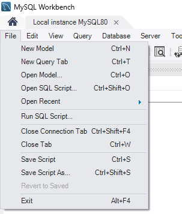

# University of Liverpool - Database Project

This project was built for helping users to manage academic operations.

## Setup

### Initializing the database

This project is using MySQL for managing the data.

Before running this project you should initialize the database properly.

1. Install **MySQL Workbench** and **MySQL server**
2. Ensure your MySQL server is running properly on **port 3306**

### Executing the SQL scripts

In db/ there are two scripts that must be run on MySQL Workbench.

Open MySQL Workbench and click on `File > Run SQL Script`:

Select the file `db/University.sql` - this will run the script
Then, after running the 1st script you can do the same for `db/Seed.sql`

PS: If you can't run the SQL directly, you can also click on `Open SQL Script` and run each of them manually through the UI

Now your database is properly initialized and with enough data to run the project.

### Running the code

1. Have python v3+ installed in your machine
2. Run `pip -r install requirements.txt` in order to install the deps
3. Execute it by running `python src/main.py`

## Queries

The following queries/statements (12) were implemented:

- Return all lecturers
- Return all courses
- Return all students
- Search lecturers
- Search courses
- Search students
- Return lecturers with no advised students
- Return lecturers which has no course yet
- Return students that completed studies with a final grade above 70%
- Return students which has not enrollment yet
- Return courses which has no students yet
- Return courses and the following lecturer + expertise area
